# Configuración de VirtualBox - Instalación de la máquina cliente Ubuntu 

[TOC]

## 1 - Configuración de VirtualBox

Lo primero es escoger el modo _Experto_ en las preferencias de VirtualBox


Vamos a añadir una red tipo NAT para poder conectar varias maquinas virtuales


De damos a crear, luego le cambiamos el nombre y modificamos la IP

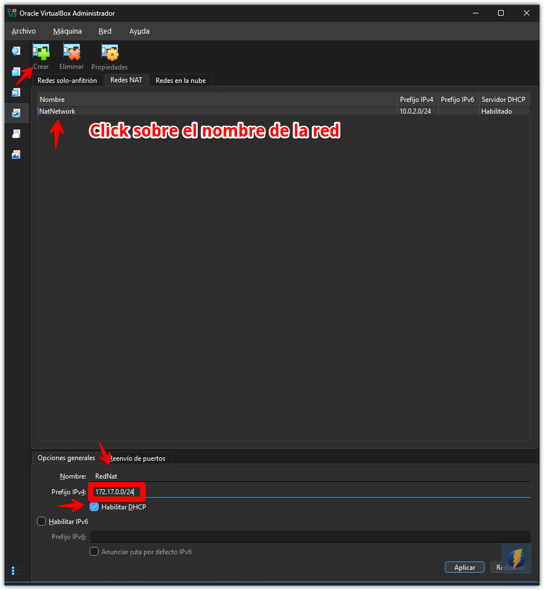

<div style="page-break-after: always;"></div>
## Creación de la nueva máquina Cliente Ubuntu

Establecemos los parámetros de la maquina nueva

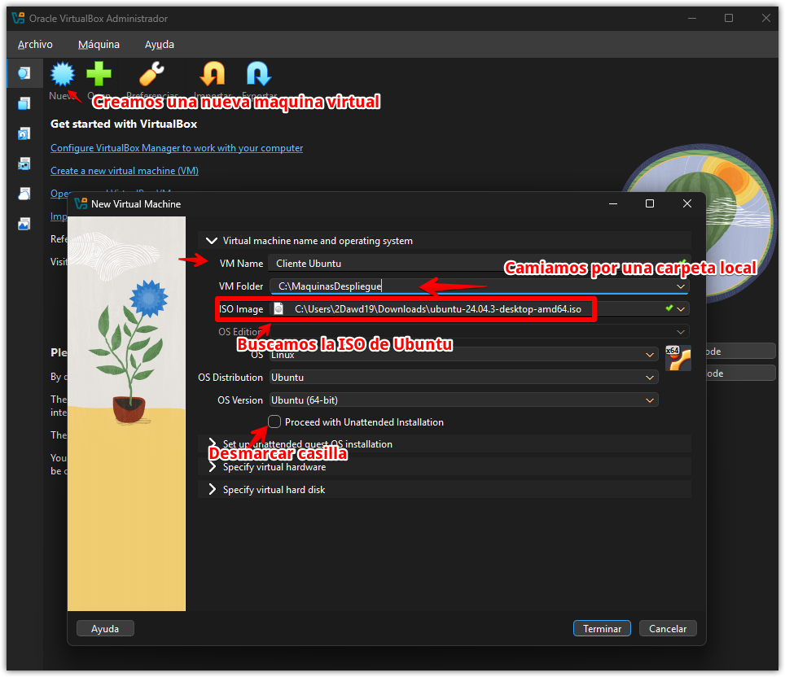

Modificamos la RAM y subimos a 4GB y cambiamos a 4CPUs

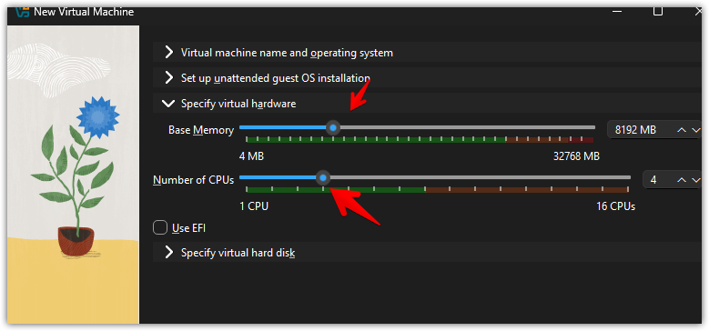

Cambiamos a 40GB de almacenamiento

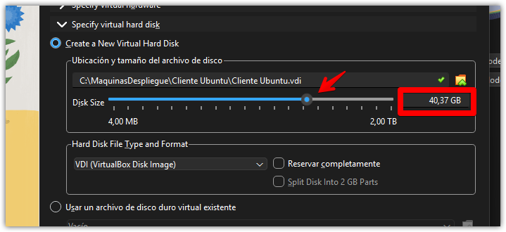

Le damos a terminal luego

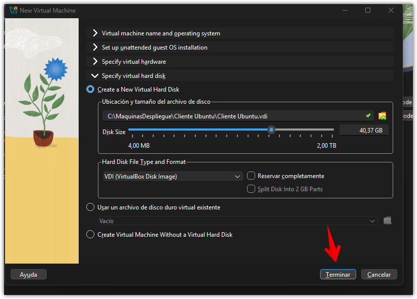


Cambiaremos ahora algunos ajustes:

- Nos vamos a **configuración -> descripción** guardamos el usuario y contraseña para acordarnos de ella

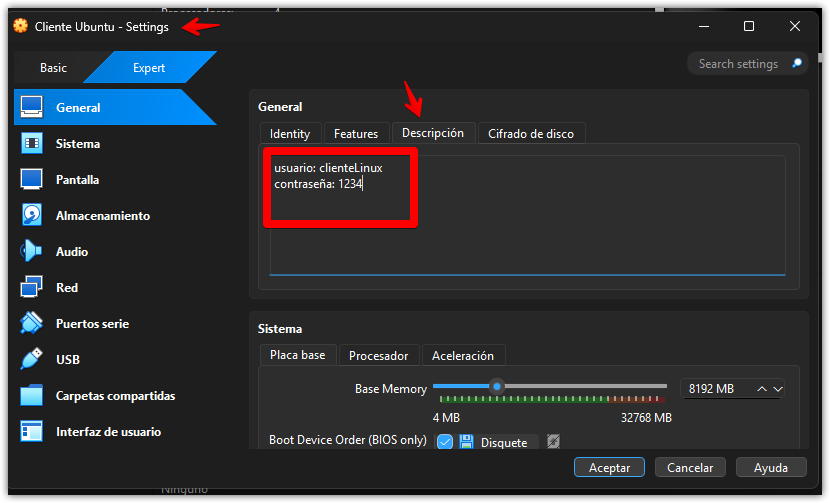

- Si necesitas grabar cosas con ella le desactivas el audio

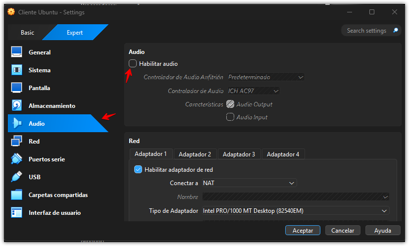

- El adaptador de red lo cambiamos con el que creamos anteriormente, en este caso Red Nat y le damos **Aceptar**

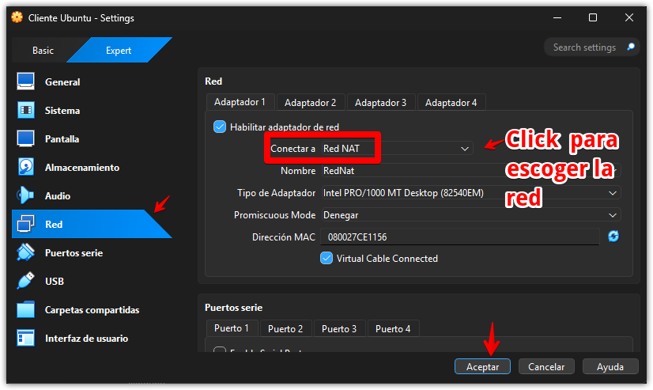

> Configuración finalizada, ya podemos inicial la maquina 
> 
<div style="page-break-after: always;"></div>
## 3 - Instalación de la maquina virtual

Nos van apareciendo distinta opciones


Buscamos el nombre que habíamos guardado en descripción y usamos la misma contraseña que tenemos


Damos siguiente hasta el final y dejamos que termine de instalarse


Al finalizar damos click en reiniciar y ya puedes usar linux


## 4 - Instalación de los Guest Aditions

Ya iniciada la maquina virtual nos vamos a dispositivos y de damos a insertar imagen de CD

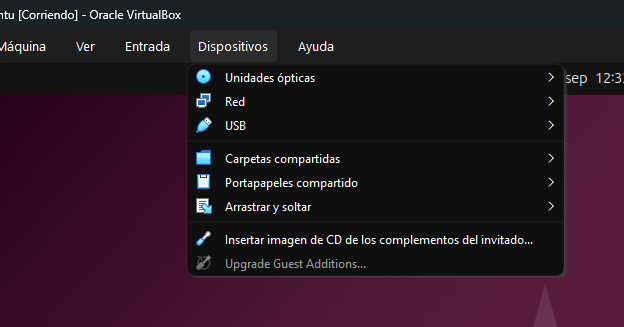

Ahora nos vamos al explorador de archivos de la maquina virtual y le damos en ejecutar programa e introducimos la contraseña cuando la pida

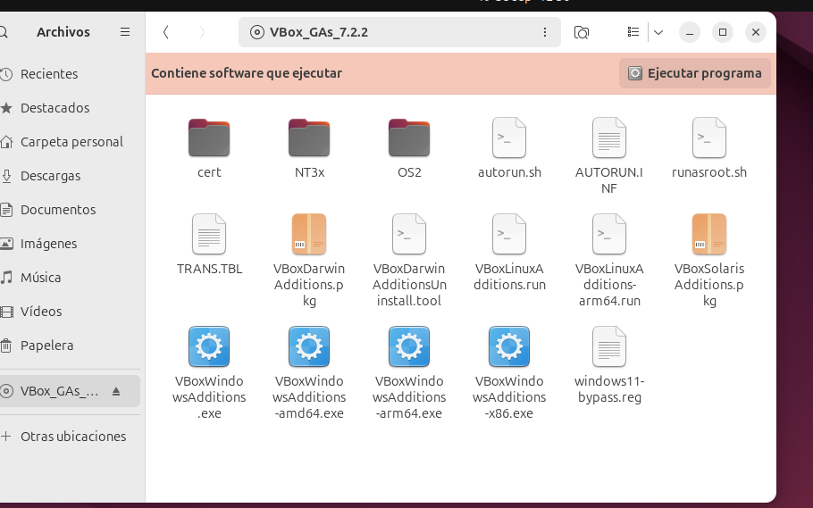

Nos dará un error

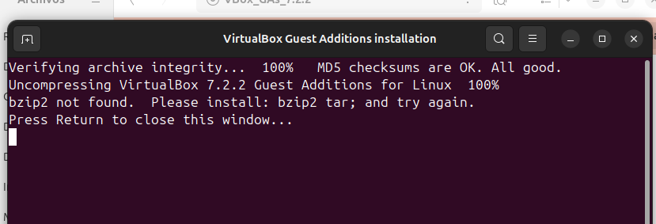

Usaremos el siguiente comando en la consola de comandos

```
sudo apt install bzip2 tar
```

Nos pedirá la contraseña, ingresamos

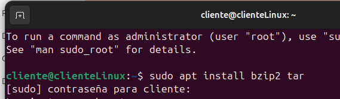

Luego ingresamos el siguiente comando

```
sudo apt install virtualbox-guest-utils
```

Y ejecutamos

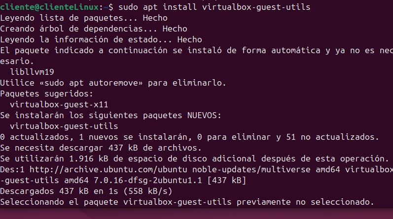

También ejecutamos el siguiente comando:

```
sudo usermod -aG vboxsf cliente
```

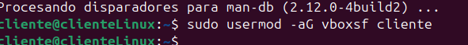

