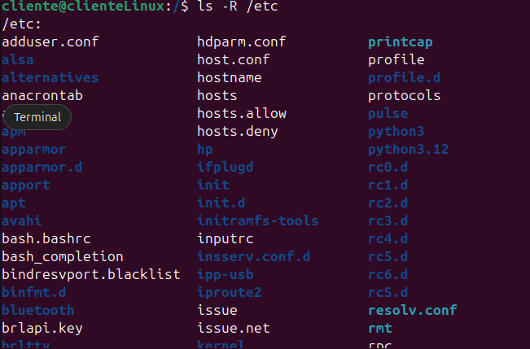

# **Repaso Linux**

Cambiar a IP estática si Linux da error al instalar o actualizar


Listado de comandos útiles:


A continuación se muestra una tabla con los directorios más importantes de un sistema Linux:


## Capitulo 2

**Comandos utilizados**

- **pwd** - muestra cuál es el directorio de trabajo actual, en otras palabras, le dice al usuario dónde se encuentra dentro de la estructura de directorios del sistema. Es muy útil cuando estamos perdidos.

- **ls** - muestra el contenido del directorio actual. Por defecto, los archivos ocultos no se muestran. Éste es seguramente el comando que más se utiliza.

- **cd** -  (change dir) permite cambiar de directorio. Si se utiliza tal cual, sin ningún tipo de argumento, cambia al directorio de trabajo personal. Si se utiliza seguido de una ruta, cambia al directorio que se indica.

- **mkdir** - Se pueden crear directorios ejemplo: mkdir matematicas

- **cat** - muestra por pantalla el contenido de un fichero y, cuando termina, el usuario está otra vez de vuelta en la línea de comandos. Por ejemplo: 

  ```
  cat /var/log/dmesg 
  ```

  

- **more** -  hace lo mismo que *cat*, a diferencia de que muestra el fichero pantalla a pantalla, es decir, llena de texto la pantalla y se espera a que el usuario pulse la tecla  para pasar a la siguiente: 

  ```
  more /var/log/dmesg
  ```

  

- **less** - es el más versátil de los tres, ya que permite moverse hacia delante y hacia atrás dentro del fichero, utilizando los cursores o las teclas de “AvPág” y “RePág”:  

  ```
  less /var/log/dmesg
  ```

  

- **head y tail** - permiten mostrar de forma parcial el contenido de un fichero. Como su nombre indica, head muestra las primeras líneas del fichero (la cabecera) y tail muestra las últimas líneas (la cola). ejemplos:  

  ```
  head /boot/grub/menu.lst
  ---
  tail /boot/grub/menu.lst
  ```

- **touch** - permite crear un fichero vacío. Con cualquier editor de texto se puede crear un fichero vacío pero con touch es especialmente cómodo y rápido.

- **ee** -  es un editor muy rudimentario pero al mismo tiempo efectivo. Podemos editar el archivo anterior y escribir alguna frase: 

  ```
  ee prueba.txt
  ```

Resumen de los comandos:


### **Ejercicios Capitulo 2**

*¿En qué directorio se encuentran los ficheros de configuración del sistema?* 

/etc

*Para entrar en un sistema Linux hace falta:*

 b) nombre de usuario y contraseña

*Muestra el contenido del directorio actual.*

```cmd
pwd
```


*Muestra el contenido del directorio que está justo a un nivel superior.*

```cmd
ls ../
```


*¿En qué día de la semana naciste?, utiliza la instrucción cal para averiguarlo.*

Usando *cal* se ingresa el año y te despliega el calendario de ese año

```
cal 2005
```


*Muestra los archivos del directorio /bin*

```cmd
ls ../../bin
```


*Suponiendo que te encuentras en tu directorio personal (/home/nombre), muestra un listado del contenido de /usr/bin a) con una sola línea de comando,*

```bash
ls
```


*Muestra todos los archivos que hay en /etc y todos los que hay dentro de cada subdirectorio, de forma recursiva (con un solo comando).*

```bash
ls ../../etc
```


*Muestra todos los archivos del directorio /usr/X11R6/bin ordenados por tamaño (de mayor a menor). Sólo debe aparecer el nombre de cada fichero, sin ninguna otra información adicional.*

```bash
ls -lsh
```


*Muestra todos los archivos del directorio /bin ordenados por tamaño (de menor a mayor). Sólo debe aparecer el tamaño y el nombre de cada fichero, sin ninguna otra información adicional. El tamaño de cada fichero debe aparecer en un formato “legible”, o sea, expresado en Kb, Mb, etc*

`du -h * | sort -h`


*Muestra el contenido del directorio raíz utilizando como argumento de ls una ruta absoluta.*

```bash
ls /
```


*Muestra el contenido del directorio raíz utilizando como argumento de ls una ruta relativa. Suponemos que el directorio actual es /home/elena/documentos.*

```bash
ls ../../
```

*Crea el directorio gastos dentro del directorio personal.ls*

```bash
mkdir gastos
```


*¿Qué sucede si se intenta crear un directorio dentro de /etc?*

No permite la creación por falta de accesos


*Muestra el contenido del fichero /etc/fstab*

(No se encuentra, se usan otros para el ejemplo)

```bash
ls hp
ls hosts
ls gnome
```


*Muestra las 10 primeras líneas del fichero /etc/bash.bashrc*

```bash
head bash.bashrc
```


*Crea la siguiente estructura de directorios dentro del directorio de trabajo personal*

```bash
//creción del directorio principal
mkdir multimedia
cd multimedia 
```


```bash
//creación de directorios secundarios y terciarios 
mkdir musica
mkdir imagenes
mkdir video
mkdir presentaciones

cd imagenes
mkdir personales 
mkdir otras
```


```bash
//Usamos tree para mostrarlo en forma de arbol desde multimedia
tree
```


*Crea un fichero vacío dentro del directorio musica, con nombre estilos_favoritos.txt*

```bash
touch estilos_favoritos.txt
```


*Utiliza tu editor preferido para abrir el fichero estilos_favoritos.txt e introduce los estilos de música que más te gusten. Guarda los cambios y sal.*

```bash
nano estilos_favoritos.tx
```

Damos intro y nos envía a la siguiente pestaña


Escribimos y con ctrl+O guardas y sales con ctrl+X

*Muestra todo el contenido de estilos_favoritos.txt*

```bash
cat estilos_favoritos.txt
```


*Muestra las 3 primeras líneas de estilos_favoritos.txt*

```bash
head -3 estilos_favoritos.txt
```


Muestra la última línea de estilos_favoritos.txt

```bash
tail -1 estilos_favoritos.txt
```


## Ejercicios Capitulo 3

Utilización de los símbolos:


Comandos importantes a tener en cuenta:


Ejercicios:

*Muestra todos los archivos del directorio actual que son imágenes jpg*

```bash
ls *.jpg
```


*Muestra todos los archivos del directorio /usr/bin que empiecen por la letra j*

```bash
ls usr/bin/j*
```


*Muestra los archivos que empiecen por k y tengan una a en la tercera posición, dentro del directorio /usr/bin*

(No hay ficheros que empiecen por k y tengan una a en tercera posición)

```bash
ls usr/bin/k?a*
```


Ejemplo con k y r en tercera posición

 

*Muestra los archivos del directorio /bin que terminen en n.*

```bash
ls usr/bin/*n
```


*Muestra todos los archivos que hay en /etc y todos los que hay dentro de cada subdirectorio, de forma recursiva.*

```bash
ls -R /etc
```



*Crea un directorio en tu directorio de trabajo con nombre prueba. Copia el archivo gzip del directorio /bin al directorio prueba. Crea un duplicado de gzip con nombre gzip2 dentro de prueba*

copia del gzip

```bash
cp bin/gzil home/cliente/prueba
```


duplicado de gzip

```bash
cp gzip gzip2
```


*Cambia el nombre de prueba a prueba2. Crea prueba3 en el mismo nivel que prueba2 y mueve todos los ficheros de prueba2 a prueba3. Borra prueba2.*

```bash
mv prueba prueba2
mkdir prueba3
mv prueba2/* prueba3
ls prueba3
rm -R prueba2
```


*Crea un fichero vacío con nombre “*?Hola caracola?*”. ¿Se puede? En caso de que se pudiera, ¿sería recomendable poner nombres así? Razona la respuesta.*

```bash
touch ?hola caracola?
```


No es lo recomendable ya que para empezar nos hace dos ficheros por el espacio y cuando queramos filtrar con la primera o la ultima letra podrá prestarse a confusiones 

*Crea un directorio con nombre multimedia_pruebas y copia en él todo el contenido del directorio multimedia. A continuación crea en multimedia/video/ dos ficheros, uno con nombre peliculas.txt y otro con nombre actores.txt. Edita el fichero peliculas.txt e introduce el nombre de tu película favorita. A continuación, crea en multimedia_pruebas/video/ otro fichero que también tenga por nombre peliculas.txt, edítalo y esta vez escribe el nombre de tus cinco películas favoritas. Ahora haz una copia de todo el contenido de multimedia en multimedia_prueba de tal forma que sólo se copien los contenidos nuevos, es decir, si hay coincidencia en el nombre de un archivo se respetará el que se haya modificado más recientemente. Para comprobar que se ha hecho todo correctamente, basta mirar si en multimedia_prueba/video está el archivo vacío actores.txt y además el archivo peliculas.txt debe contener 5 películas y no 1*

